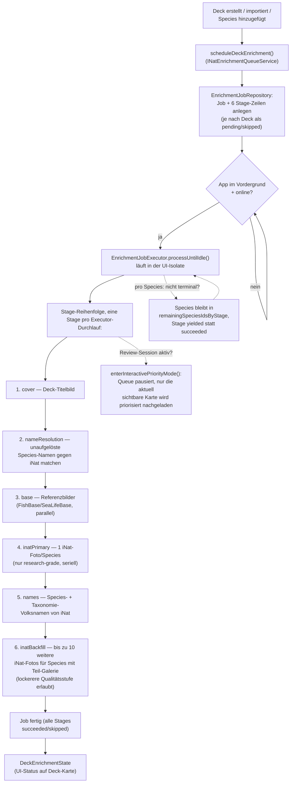

# iNaturalist-Enrichment — wie der Ablauf funktioniert

**Kategorie:** Architektur-Referenz (Ist-Zustand) · **Status:** Aktuell (Stand 2026-07-22)

Kurzreferenz für den aktuellen Enrichment-Ablauf, nachdem in letzter Zeit
mehrere Änderungen daran gemacht wurden (Terminal-State-Fix für
Bild-Downloads, Foreground-only-Umstellung). Für offene Probleme/Ideen siehe
[`tasks/inaturalist-enrichment-strategy.md`](tasks/inaturalist-enrichment-strategy.md),
für die geplante Import-weite Umstellung siehe
[`architecture-overview.md` §4.8–4.9](architecture-overview.md#48-target-design-import-wide-inaturalist-enrichment).

## Wozu

Nach Erstellen/Importieren eines Decks (oder Hinzufügen von Species zu einem
bestehenden Deck) reichert Discere jede Species im Hintergrund an:
Referenzbilder aus der ETL-Datenbank herunterladen, zusätzliche Fotos und
mehrsprachige Volksnamen von iNaturalist nachladen. Ziel: möglichst schnell
mindestens ein Bild pro Species, ohne die App zu blockieren.

## Ablauf

## Die 6 Stages im Detail

Reihenfolge ist fix (`EnrichmentJobRepository._nextRunnableStage`), eine
Stage muss abgeschlossen sein, bevor die nächste startet. `cover` und
`nameResolution` werden übersprungen (`skipped`), wenn es nichts zu tun gibt
(kein Cover-URL bzw. keine unaufgelösten Namen).

| # | Stage | Was passiert | Bilder-Quelle |
|---|---|---|---|
| 1 | `cover` | Lädt das Deck-Titelbild herunter, falls beim Import eine URL mitgegeben wurde. | — |
| 2 | `nameResolution` | Species, die beim Import nur als Freitext-Name vorlagen (keine FishBase/SLB-ID), werden über iNat aufgelöst und dem Deck hinzugefügt. | — |
| 3 | `base` | Referenzbilder aus der ETL-Datenbank (`pictures`-Tabelle, `is_usable = 1`) herunterladen. Läuft **parallel** (mehrere Species gleichzeitig). | `reference_images/` |
| 4 | `inatPrimary` | Ein Foto pro Species von iNaturalist — nur `quality_grade: research` (von der Community verifiziert). Läuft **seriell** (ein Request nach dem anderen, mit Delay), um iNats Rate-Limits zu schonen. | `external_images/` |
| 5 | `names` | Species- und Taxonomie-Volksnamen (Genus/Familie/Ordnung/Klasse) von iNat, mehrsprachig. | — |
| 6 | `inatBackfill` | Für Species mit weniger als 10 gecachten Fotos: bis zu 10 weitere Fotos nachladen, dabei auch niedrigere Qualitätsstufen (`needs_id`/`casual`) erlaubt (`allowTier3Fallback`). | `external_images/` |

**Bekannte Lücke (siehe unten):** Species, für die Stage 4 (`inatPrimary`)
null Fotos fand (nicht bloß wenige, sondern exakt null), werden von Stage 6
komplett übersprungen (`_buildBackfillINatPhotoQueue`) — sie bekommen nie die
Chance auf die lockerere Qualitätsstufe. Betroffen z. B. `Porcellanella
triloba`: iNat hat dafür nur `casual`/`needs_id`-Fotos, keine
`research`-grade — die Species bleibt deshalb dauerhaft ohne Bild, obwohl
iNat welche hätte. Noch nicht entschieden, ob das Verhalten korrigiert werden
soll (bewusste Qualitätsgrenze vs. Bug) — siehe Notiz in
[`tasks/inaturalist-enrichment-strategy.md`](tasks/inaturalist-enrichment-strategy.md).

## Die Terminal-State-Regel

Der Kern-Grundsatz der ganzen Pipeline: **eine Species gilt erst als fertig
für eine Stage, wenn sie einen echten Endzustand erreicht hat** — nicht
schon, wenn die Stage sie nur einmal angefasst hat.

Terminal heißt:
- die Daten wurden tatsächlich erfolgreich geschrieben (inkl. Bild als
  lokale Datei — siehe Bugfix unten), **oder**
- ein expliziter No-Result-Marker wurde geschrieben (`inat_photo_cache`
  speichert `__empty__`, `runtime_common_names` einen No-Result-Marker,
  wenn iNat den Taxon zwar auflösen konnte, aber nichts liefert)

Ist eine Species noch nicht terminal, bleibt sie in
`remainingSpeciesIdsByStage` und wird beim nächsten Executor-Durchlauf erneut
versucht — die Stage wird als `yielded` statt `succeeded` markiert.

**Kürzlich behobener Bug:** Bis vor kurzem galt eine Species schon als
terminal, sobald iNat eine Foto-*URL* geliefert hatte — unabhängig davon, ob
der anschließende Datei-Download tatsächlich klappte (`ImageService`
verschluckt einzelne Download-Fehler und gibt nur `null` zurück, statt zu
werfen). Ergebnis: `imageStagesComplete` sprang auf `true`, obwohl für
manche Species nie eine lokale Bilddatei ankam — die Flashcard erschien dann
ohne Bild, meist erst in einer *späteren* Lern-Session (die erste hatte die
Karte noch versteckt, weil `imageStagesComplete` da noch `false` war). Fix:
`onSpeciesCompleted` wird jetzt erst aufgerufen, wenn der Download
tatsächlich eine lokale Datei erzeugt hat (`lib/enrichment/service/enrichment_service.dart`,
alle drei Foto-Download-Pfade). Regressionstests dazu in
`test/enrichment/service/enrichment_service_test.dart`.

## Laufzeitmodell

- **Läuft komplett in der UI-Isolate**, kein separater Background-Isolate
  mehr. Der frühere Workmanager-Pfad wurde entfernt, weil er mit der
  UI-Isolate um den SQLite-Writer-Lock der User-DB konkurrierte
  (`lib/app/background/inat_background_task.dart` existiert nur noch als
  No-Op-Callback für Workmanager-Wakeups von alten App-Versionen).
- Damit der Android-Prozess bei Bildschirm aus nicht vom OS beendet wird,
  hält `EnrichmentForegroundServiceKeeper` einen echten Android-Foreground-
  Service mit Notification am Laufen, solange Jobs offen sind.
- Getriggert wird der Executor-Loop (`processUntilIdle`) bei
  `scheduleDeckEnrichment()` (Deck erstellt/importiert/bearbeitet) und immer
  wieder, wenn die App in den Vordergrund kommt (`AppLifecycleState.resumed`).
  Läuft nur, wenn online (`NetworkAvailability`).
- **Pausiert während einer aktiven Lern-Session:** `DeckPage` ruft beim
  Öffnen `enterInteractivePriorityMode()` auf — die Queue hält an, damit sie
  nicht mit dem gezielten Nachladen der gerade sichtbaren Karte
  (`ensureSingleImageForSpecies`) um Bandbreite/DB-Zugriff konkurriert.
- **Host-Cooldown/Retry:** `HostCooldownTracker` erkennt wiederholte
  Fehler/Rate-Limits pro Host und pausiert weitere Requests dorthin
  temporär. Stage-Retries eskalieren mit Backoff bis zu einem Limit
  (`_maxTemporaryRetries`), danach `failedPermanent`.

## Wichtige Komponenten

| Komponente | Verantwortung |
|---|---|
| `INatEnrichmentQueueService` | Einstiegspunkt (`scheduleDeckEnrichment`), Lifecycle-Steuerung, leitet `DeckEnrichmentState` für die UI ab |
| `EnrichmentJobExecutor` | Führt Stages der Reihe nach aus, persistiert Checkpoints, wendet die Terminal-State-Regel an |
| `EnrichmentJobRepository` | Speichert Job/Stage-Zeilen, `remainingSpeciesIdsByStage`, Leases, Retry-Zähler |
| `EnrichmentService` | Macht die eigentlichen Foto-/Volksnamen-Fetches gegen iNat und schreibt die Caches |
| `EnrichmentForegroundServiceKeeper` | Android-Foreground-Service-Notification, solange Jobs laufen |
| `HostCooldownTracker` | Pausiert Requests an einen Host nach wiederholten Fehlern |

## Wo die UI das liest

- `DeckEnrichmentHint` (Deck-Karte) zeigt Status-Icon + Text aus
  `DeckEnrichmentInfo`/`DeckEnrichmentState` (`loading`, `done`,
  `doneWithGaps`, `failed`, …).
- `DeckSessionPresenter.filterReviewableCards` entscheidet pro Flashcard: ist
  `imageStagesComplete` (= `base`+`inatPrimary` für alle Species terminal)
  noch `false`, werden fällige Karten ohne lokales Bild versteckt; ist es
  `true`, werden alle fälligen Karten gezeigt, auch ohne Bild.
- **Fehlt aktuell:** eine Deck-weite, persistente Aussage "für N Species
  wurde kein Foto gefunden" — dazu mehr in
  [`tasks/species-without-photo-notification.md`](tasks/species-without-photo-notification.md).
